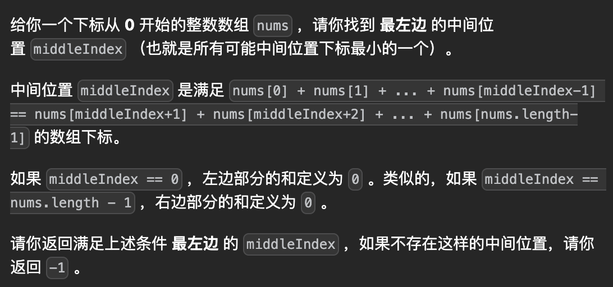

# 寻找数组的中心索引

## leetcode：https://leetcode.cn/problems/find-the-middle-index-in-array/description/

## 难度：简单

## name：findMiddleIndex

## 考点：前缀和

## 做法：前缀和

针对某个i，它的左边=它的右边，那么就有：左边和*2+nums[i]=sum总和

## 复杂度：o(n)+o(1)